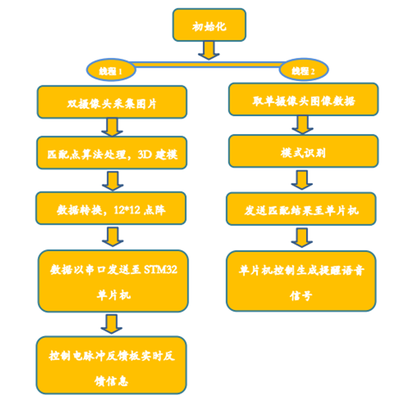
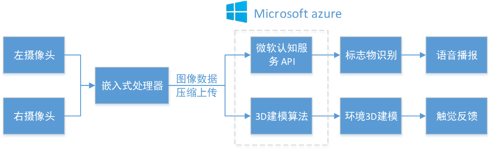
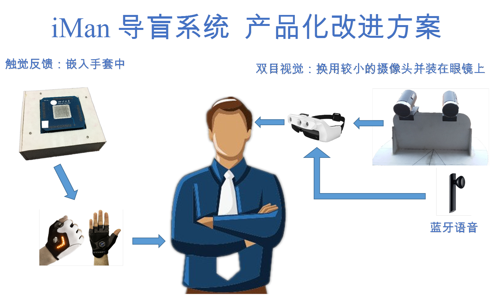

# iMan——THE BINOCULAR VISUAL GUIDE SYSTEM
##Background
With social development, more and more efforts has been made to improve the lives for disabled people, such as providing effective guide tools  for blind people. This production combines ***computer vision, touch-vision replacement and pattern recognition*** with guide system .
 

We collect the data of binocular vision through two fixed cameras ,and then use several algorithms to extract and match feature points .After eliminating those mismatches with RANSAC algorithm, three-dimensional model of substances can be rebuilt on the embedded platform, basing on inside and outside parameter matrix of two cameras . 
The feedback system is a battery lead plate with 12*12 electrodes .stm32 single chip receives data of three-dimensional model and then output commands to control battery lead plate. Each electrode outputs electrical impulse with certain frequency , voltage amplitude or duty ratio, replacing touches that stimulate fingertip and generate information of different depth. These information allow three-dimensional model to reappear in spatial visual area of the brain. During the process, image information are processed with multi-threading technology, while traffic signs and warning marks in sight are recognized by BP algorithm. Information of various signs will be feedback to users through voice module and therefore can ensure safety and convenience for blind people in crowded areas.
##Design Plan
### 3D-Modelling
   Three-dimensional reconstruction plays an important role in computer vision. It constructs a three-dimensional model on three-dimensional space from the image by means of geometric and physical techniques. The method discussed in this paper is one of three-dimensional reconstruction: a three-dimensional reconstruction method based on matching points. The basic principle is to observe the same scene from two or more viewpoints to obtain a perceived image at different perspectives. When all the points in the image are matched, the amount of computation will be quite large. Therefore, we first look at the feature points in each image, and then match the feature points in the two images to get the same points in the different images Mapping, and finally according to the principle of triangulation to calculate the three-dimensional information of the scene.
 

   The main steps: calculate the camera's internal reference, external reference; find the matching point in the image and eliminate the wrong match; use the matching point in the image to calculate the three-dimensional coordinates of the point; use openGL space coordinates of the point cloud show; The cloud filter is normalized and converted to a 12 * 12 matrix, which is used to supply the pulse feedback board.
### Electric pulse feedback system
   Function Overview: This module is mainly used to form the 12 * 12 dot matrix coordinate data formed by the previous chapter 3D modeling to the blind user in the form of electrical stimulation. According to the above visual alternative theory, The brain visual center forms image information. There are 12 * 12 lattice on the electric pulse plate, corresponding to the 12 * 12 coordinate plane (the coordinate plane is perpendicular to the user's advancing direction) at 3D modeling. Each point of the electric pulse plate can control the stimulating current, Reflect the location of the obstacle near the distance. So that the obstacle 3D information can be reconstructed in the user's brain according to the stimulus intensity of each point on the electric pulse plate.
### Marker pattern recognition
   The main function of this module is to achieve the process of walking some important markers of identification. In the above two modules, you can already go out of the blind process of physical terrain and obstacles in 3D modeling imaging, the blind through the electric touchpad feedback perception can be obtained in front of the general terrain situation, but in the city Life, to identify the important signs of urban traffic is also very important, because if the blind people want to cross the road, simply rely on the physical terrain perception has been unable to ensure the smooth passage, and as a travel between people and the traffic rules and transport facilities And often through the visual tips pedestrians, such as traffic lights, zebra, road signs and warnings, etc., this is precisely the blind people need but can not get the information. This part of the realization of the function will bring great convenience to the blind travel.

Therefore, in this module, we mainly in the process of walking on the zebra crossing, traffic lights and other features (later may also increase the road signs, warnings and other functions with the ability to identify the text) to ensure that in most cases can identify (If the signposts and warnings are identified to correctly identify most of the text), this part of the function of the recognition frame rate does not need to be too high, taking into account the operation of the embedded platform Ability and 3D modeling of the time-consuming situation, as long as 1-3 frames per second to achieve practical requirements.

## Future work
We want to develop our product smarter and more convenient for the blind in the future. The next generation of our product shows as follows.
 

## Achievements
* [code](./code/)
* The 15th  Imagine Cup 3rd  Prize in Sichuan region（[Imagine Cup official Website](https://imagine.microsoft.com/zh-cn/Events?id=0&skillLevel=0)）
* [Project Video](https://pan.baidu.com/s/1dDWjT_6zTjYLYlm1twO7BQ?errno=0&errmsg=Auth%20Login%20Sucess&&bduss=&ssnerror=0&traceid=)

